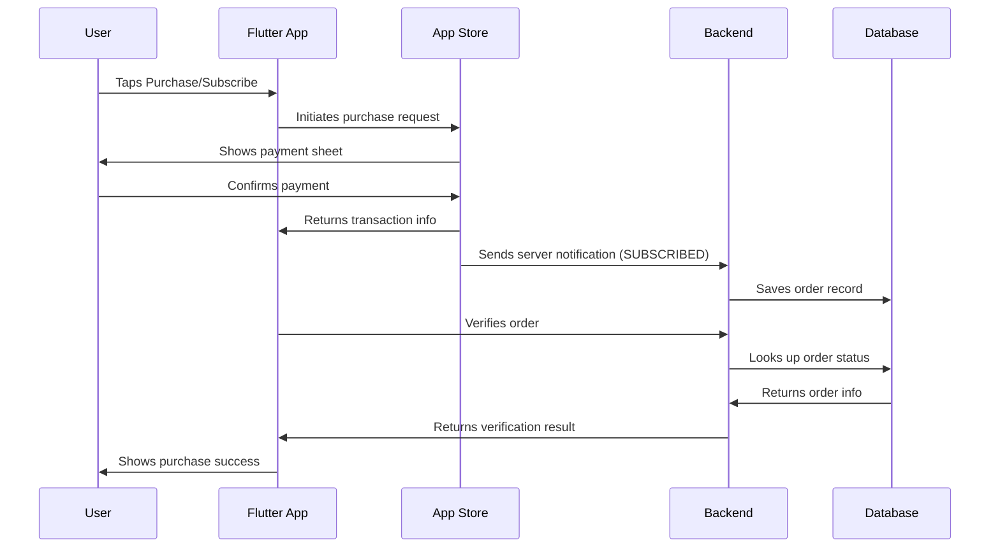

## Overview

This guide walks you through implementing **in-app purchases and subscriptions** in a Flutter app using App Store, along with best practices for handling edge cases and preventing lost transactions. I'm assuming you already have some basic Flutter experience — you can build a UI, navigate between screens, that sort of thing.

Follow along step by step and you'll have a solid IAP implementation by the end. One caveat: **this guide assumes you have your own account system on the backend. If your app manages subscriptions entirely offline, this might not be the right fit for you.**

This is also drawn from my own experience building [FlowFerry](https://www.ygeeker.com/flowferry).

## Setting Up App Store Connect

Before writing any code, you need to configure your products in App Store Connect. App Store offers two types of purchases: subscriptions and consumables. For lifetime access, use an In-App Purchase. For recurring plans (like a monthly membership), use a Subscription.


When creating a subscription or product, you'll be asked for two values:

-   **Reference Name**: Use something human-readable, like "ClipMemo Plus"
-   **Product ID**: A unique identifier for the product. I recommend lowercase with underscores, e.g. `lifetime_plus_v2`. Heads up — once you create a product with a given ID, that ID is permanently taken, even if you delete the product later.

Next, configure availability and pricing for your target regions.


You'll also need to provide a **Server Notification URL** so Apple can send you transaction updates. We'll build that endpoint later.

Before submitting your app for review, don't forget to include these in-app purchase items in your submission.


That's it for the App Store Connect side.

## Xcode Configuration

With your products configured in App Store Connect, you need to set up a StoreKit configuration file in Xcode for local testing.

Create a new file in Xcode and choose the StoreKit type. In the dialog that appears, check "Sync this file with an app in App Store Connect" — this pulls in the product info you just configured.


You can place this file in the project root. Once created, your products should appear automatically.

A couple of things to keep in mind: if you update products in App Store Connect, you'll need to manually sync in Xcode. Also, changes may take a little while before they show up in Flutter queries.

## Flutter Implementation

Install the official [in_app_purchase](https://pub.dev/packages/in_app_purchase) package. When the user opens the purchase screen, start by fetching product details:

```dart

```

## Database Design

You'll need to store subscription data somewhere. You could go fully local — users can restore purchases when they switch devices — but if you have a backend, here's a solid schema.

First, create an `order` table to track individual transactions:

| Column         | Type | Description                                       |
| -------------- | ---- | ------------------------------------------------- |
| product_id     | text | Product ID, matching the one in App Store Connect |
| transaction_id | text | Transaction ID provided by Apple                  |
| purchase_date  | date | When the purchase was made                        |
| expires_date   | date | When the subscription expires                     |

Then create a `subscription` table to track active entitlements (including lifetime purchases):

| Column        | Type | Description                                        |
| ------------- | ---- | -------------------------------------------------- |
| product_id    | text | Product ID, matching the one in App Store Connect  |
| user_id       | text | Your internal user ID                              |
| purchase_date | date | When the purchase was made                         |
| expires_date  | date | When the subscription expires                      |
| is_lifetime   | bool | Whether this is a lifetime (non-expiring) purchase |

## Server-Side Implementation

The server is the most involved piece of the puzzle, so read carefully. The framework doesn't matter much — the logic is the same. I'll use JavaScript for the examples.


Let's start by listing what the server actually needs to do:

1. Receive purchase notifications from Apple
2. Receive auto-renewal notifications from Apple
3. Receive offer redemption notifications from Apple
4. Handle order verification requests from the app
5. Handle subscription status queries from the app

So you'll need two endpoints (or edge functions): one for App Store Server Notifications, and one for requests from your app. I'd recommend reading through Apple's [documentation on the notification payload](https://developer.apple.com/documentation/appstoreservernotifications/responsebodyv2decodedpayload) first.

Here's the full purchase flow:



This design **prevents users from switching accounts in the app and repeatedly using "Restore Purchases" to give multiple accounts subscription access.**

After decoding the notification payload, route on `notificationType` to decide what to do. Here are the common ones — check Apple's docs for the full list:

-   **OFFER_REDEEMED**: A promo code was redeemed. Store the redemption so you can verify it later.
-   **SUBSCRIBED**: A user completed a purchase. Insert the order into your database and wait for the app to query it.
-   **DID_RENEW**: An auto-renewing subscription renewed successfully. Look up the user by transaction ID and extend their expiration date.
-   **REFUND**: The user got a refund. Find the user by transaction ID and revoke their subscription.

Here's a reference implementation:

```ts
// Supabase Edge Function
import { createClient } from "@supabase/supabase-js";

const supabase = createClient(
	process.env.SUPABASE_URL,
	process.env.SUPABASE_ANON_KEY
);

export async function onRequest(context) {
	const { request } = context;
	const { data, error } = await supabase.from("orders").insert({
		product_id: request.body.product_id,
		transaction_id: request.body.transaction_id,
		purchase_date: request.body.purchase_date,
		expires_date: request.body.expires_date,
	});
}
```

Once your server is up and running, submit the notification endpoint URL in App Store Connect.

## Handling Edge Cases

A common gotcha: the app sends an order verification request, but Apple's notification hasn't hit your server yet — so the order isn't in the database. The fix is simple:

-   If the first verification attempt fails, wait a few seconds and try again.

## Testing

You can test in-app purchases in three environments:

-   **Xcode Simulator**: No server notifications — useful for UI testing only
-   **TestFlight (Sandbox)**: Full server notifications — closest to production
-   **App Store (Production)**: The real deal

For realistic testing, create sandbox test accounts in App Store Connect. You can simulate different regions and subscription scenarios.


## App Store Review Compliance

Apple has strict requirements around in-app purchases. Here are a couple of things that tripped me up during review:

-   You **must** show clear success/failure feedback for "Restore Purchases"
-   You **must** have a visible link to your Terms of Service that explains what the user is buying, how subscriptions work, and how to cancel

## Related

-   [Flutter IAP Guide: Stripe for Web](https://www.ygeeker.com/p/flutter-iap-guide-stripe)
