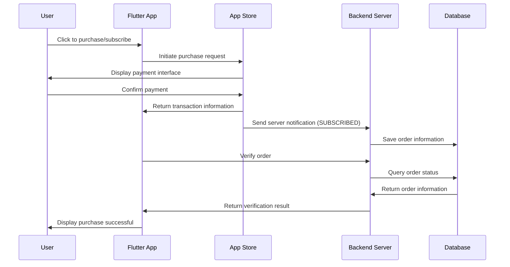

## Overview

This article will introduce the implementation of **in-app purchases and subscriptions** for Flutter Apps integrated with the App Store, as well as best practices for handling exceptions and preventing order loss. It is assumed that the reader has basic Flutter development experience (able to write basic UI).

By following this article step by step, you can achieve a perfect in-app purchase feature. Note: **This article is suitable for those who have their own account system. If your app completely manages subscriptions offline, this article may not be suitable for you.**

This is also a summary of my experience with [FlowFerry](https://www.ygeeker.com/flowferry).

## App Store Store Setup

Developers need to configure product information in App Store Connect in advance. There are two types of purchases in the App Store: subscriptions and consumables. For permanent memberships, it is recommended to use In-App Purchase, while for subscription types (e.g., memberships), use Subscription.


When creating a subscription or product, you will be required to provide two values:

- Reference Name: It is recommended to write in a human-readable format, such as ClipMemo Plus.
- Product ID: The product ID, recommended to be connected with underscores and in lowercase. For example, lifetime\_plus\_v2. Note: Once this product is created, this ID cannot be reused (even if you delete this product).

Then configure the available regions and prices.


Finally, we need to provide a server notification API to receive notifications from Apple.

Before submitting the version, don't forget to check these in-app purchase options for submission.


At this point, the App Store setup is complete.

## Xcode Configuration

Once configured, we need to add StoreKit in Xcode for local testing.

Create a new file in Xcode and select StoreKit. In the pop-up window, check the "Sync this file with an app in App Store Connect" option. This operation will automatically sync the product information we configured in the background.


You can place this file in the root directory. Once created, the product information set in the background will be synced.

It is worth mentioning that if you update the product in the background, you need to manually click sync in Xcode. Additionally, after updating product information, it may take some time to be queried by Flutter.

## Flutter Code Implementation

First, you need to install the official in-app purchase tool `in_app_purchase`. After opening the purchase page, you need to first retrieve the product information:

```dart
```

## Database Design

We need to update the database to save users' subscription information. Of course, you can also store purchase information entirely locally. After users switch devices, they only need to click to restore purchases to update local purchase information, which will not be discussed further here.

First, add a new `order` table in the user database to store order information.

| Name              | Type   | Description                     |
| --------------- | ---- | ---------------------- |
| product\_id     | text | Product ID, consistent with App Store |
| transaction\_id | text | Transaction ID, provided by Apple       |
| purchase\_date  | date | Purchase date                   |
| expires\_date   | date | Expiration date                   |

Next, add a new `subscription` table to store subscription (including permanent buyout) information.

| Name             | Type   | Description                     |
| -------------- | ---- | ---------------------- |
| product\_id    | text | Product ID, consistent with App Store |
| user\_id       | text | User ID                  |
| purchase\_date | date | Purchase date                   |
| expires\_date  | date | Expiration date                   |
| is\_lifetime   | bool | Is it a permanent buyout                |

## Server Implementation

The server is the most complex part of the entire process, and it is recommended to read carefully. The logic for handling different service frameworks is still similar; here is an example in JavaScript.


First, clarify the **server requirements**:

1. Receive subscription notifications from Apple
2. Receive automatic renewal notifications from Apple
3. Receive redemption notifications from Apple
4. Receive order verification requests from the app
5. Receive subscription status inquiry requests from the app

Therefore, we need to write two edge functions (or APIs) to handle App Store Server Notifications and requests from the app. It is recommended to first refer to this [document](https://developer.apple.com/documentation/appstoreservernotifications/responsebodyv2decodedpayload) from the App Store.

The entire purchase process is as follows:



This design can **prevent users from switching accounts in the app and repeatedly using restore purchases to generate a large number of accounts with subscription eligibility.**

After unpacking the payload, first check the `notificationType` to determine subsequent actions. Note that only common type handling logic is listed here; for more complex business needs, it is recommended to refer to the documentation for further expansion.

- `OFFER_REDEEMED**`: Redeem invitation code. We need to store the redemption request for later verification.
- `SUBSCRIBED`: User initiates subscription (payment completed). We only need to insert the order information into the order data table, waiting for the front end to query.
- `DID_RENEW`: Automatic renewal subscription successful. We need to find the corresponding user in the database based on the provided transaction ID and extend their expiration date.
- `REFUND`: User initiates a refund. We need to find the corresponding user in the database based on the provided transaction ID and revoke their subscription.

After clarifying the ideas, here is a reference code implementation:

```ts
// Supabase Edge Function
import { createClient } from '@supabase/supabase-js'

const supabase = createClient(process.env.SUPABASE_URL, process.env.SUPABASE_ANON_KEY)

export async function onRequest(context) {
  const { request } = context
  const { data, error } = await supabase.from('orders').insert({
    product_id: request.body.product_id,
    transaction_id: request.body.transaction_id,
    purchase_date: request.body.purchase_date,
    expires_date: request.body.expires_date
  })
}
```

After configuring our server, we need to submit the API that handles notifications from the App Store to App Store Connect.

## Exception Handling

A common issue is that the client sends an order verification request, but the Apple order information has not yet been recorded. Therefore, we need to:

- Wait for a period of time to verify again after the first verification fails.

## Testing

You can test in-app purchases in three environments:

- Xcode Simulator: Cannot receive server notifications
- TestFlight Testing Environment: Can receive server notifications
- App Store Production Environment: Can receive server notifications

To closely simulate a real purchasing environment, it is recommended to create sandbox users. You can create accounts in your App Store Connect to simulate accounts from different regions. Additionally, you can click


## Compliance Requirements

The App Store has strict compliance requirements for in-app purchases. Here are some pitfalls I encountered:

- There must be a clear prompt for the success or failure of "Restore Purchase."
- There must be a clear entry point for the "Service Agreement," explaining what your product is and how to subscribe or unsubscribe.

## Related Articles

- [Flutter In-App Purchase Guide for Web Stripe](https://www.ygeeker.com/p/flutter-iap-guide-stripe)

